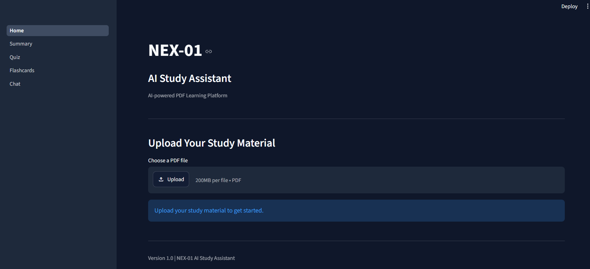
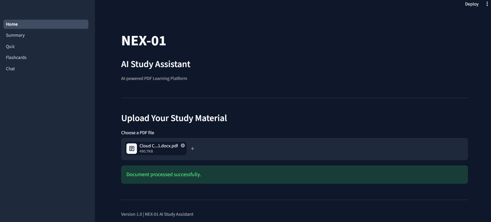
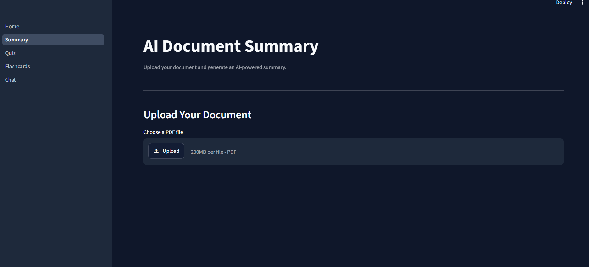
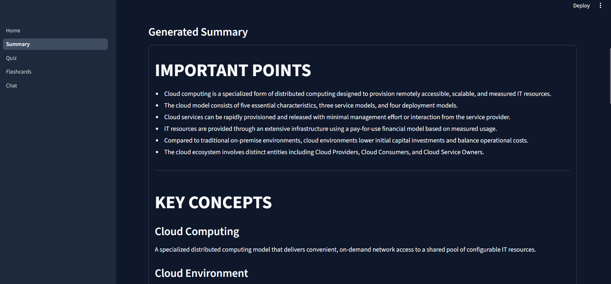
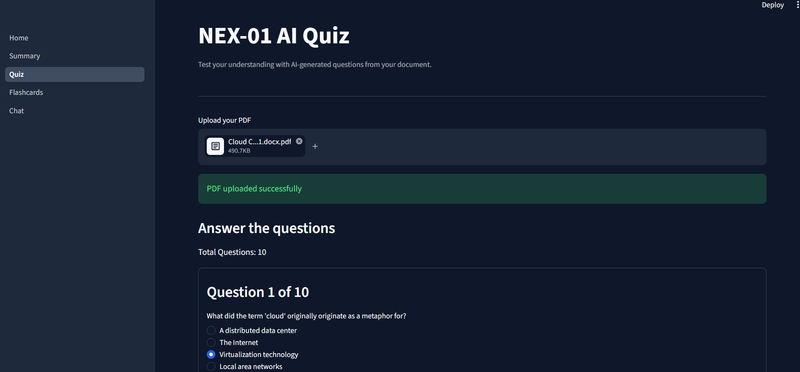
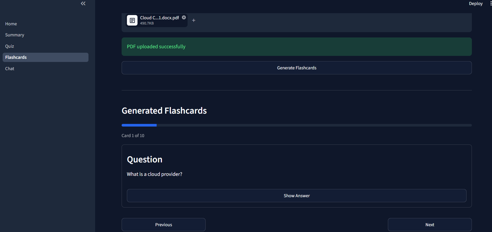
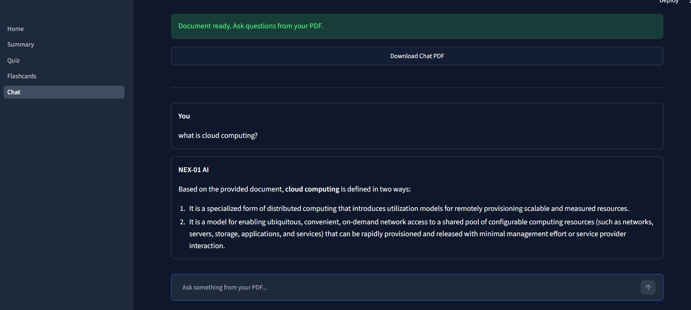

# NEX-01 AI Study Assistant

NEX-01 AI Study Assistant is an AI-powered learning application that helps students study from their own PDF documents.

Users can upload a study PDF and use AI-powered features such as document summarization, quiz generation, flashcard generation, and question answering through a Retrieval-Augmented Generation (RAG) based chat system.

## Live Demo

[Launch NEX-01 AI Study Assistant](https://nex-01-ai-mwu8zyaygof6k9ttihqshp.streamlit.app/)


## Features

### 1. PDF Upload

Upload a PDF study material directly into the application.

The system extracts the text from the uploaded document and prepares it for AI-powered learning features.

### 2. AI Summary

Generate a concise and meaningful summary of the uploaded study material.

The generated summary can also be downloaded as a PDF.

### 3. AI Quiz Generator

Generate multiple-choice questions from the uploaded PDF.

Each question contains:

- Question
- Multiple options
- Correct answer
- Explanation

The generated quiz can be downloaded as a PDF.

### 4. AI Flashcards

Automatically generate study flashcards from the uploaded document.

Each flashcard contains:

- Question
- Answer

Flashcards can be downloaded as a PDF for offline study.

### 5. Chat with PDF

Ask questions directly from the uploaded study material.

The application uses a Retrieval-Augmented Generation pipeline to retrieve relevant information from the document before generating an answer.

The chat conversation can also be downloaded as a PDF.

## Screenshots

### Home Page



### PDF Upload



### Summary Input



### Summary Output



### Quiz



### Flashcards



### Chat with PDF



## RAG Architecture

The Chat feature uses the following pipeline:

```text
PDF Document
     |
     v
PDF Text Extraction
     |
     v
Text Chunking
     |
     v
HuggingFace Embeddings
     |
     v
FAISS Vector Database
     |
     v
Relevant Document Retrieval
     |
     v
Google Gemini API
     |
     v
Context-Aware Answer
```

The system is designed to answer questions using information retrieved from the uploaded document.


## Technologies Used

### Frontend

- Streamlit

### Programming Language

- Python

### AI / LLM

- Google Gemini API

### Embeddings

- HuggingFace Sentence Transformers
- `all-MiniLM-L6-v2`

### Vector Database

- FAISS

### RAG Framework

- LangChain

### PDF Processing

- PyPDF

### PDF Generation

- ReportLab

### Environment Management

- Python Virtual Environment
- Python-dotenv

### Version Control

- Git
- GitHub

## Project Structure

```text
AI-Study-Assistant/
│
├── Home.py
├── README.md
├── requirements.txt
├── .gitignore
│
├── assets/
│   └── screenshots/
│       ├── chat.png
│       ├── flashcards_output.png
│       ├── home.png
│       ├── quiz_output.png
│       ├── summary_input.png
│       ├── summary_output.png
│       └── upload.png
│
├── pages/
│   ├── 1_Summary.py
│   ├── 2_Quiz.py
│   ├── 3_Flashcards.py
│   └── 4_Chat.py
│
└── utils/
    ├── pdf_reader.py
    ├── embeddings.py
    ├── chatbot.py
    ├── quiz.py
    ├── flashcards.py
    └── pdf_generator.py
```

## Installation

Clone the repository:

```bash
git clone https://github.com/thotliharshitha/nex-01-ai.git
```

Move into the project directory:

```bash
cd nex-01-ai
```

Create a virtual environment:

```bash
python -m venv venv
```

Activate the virtual environment on Windows:

```bash
venv\Scripts\activate
```

Install the required dependencies:

```bash
pip install -r requirements.txt
```

## Environment Variables

Create a `.env` file in the project root directory.

Add your Google Gemini API key:

```text
GOOGLE_API_KEY=your_api_key_here
```

Do not upload the `.env` file to GitHub.

Make sure `.env` is included in `.gitignore`.

## Run the Application

Start the Streamlit application using:

```bash
streamlit run Home.py
```

The application will open in your browser.

## How to Use

### Step 1

Open NEX-01 AI Study Assistant.

### Step 2

Upload your study PDF.

### Step 3

Choose a feature:

- Summary
- Quiz
- Flashcards
- Chat

### Step 4

Generate the required learning material.

### Step 5

Download the generated content as a PDF when required.

## Deployment

The application is deployed using Streamlit Community Cloud.

The deployed application automatically installs the dependencies from `requirements.txt` and runs `Home.py`.

## Security

API keys are stored using environment variables and are not included directly in the source code.

The `.env` file should never be committed to GitHub.

## Future Improvements

Possible future enhancements include:

- Support for DOCX and PPTX files
- Multiple document support
- User authentication
- Study progress tracking
- More advanced quiz modes
- Difficulty selection for quizzes
- Voice-based interaction
- Improved conversation memory
- Study analytics dashboard
- More embedding model options

## Project Goal

The goal of NEX-01 AI Study Assistant is to provide students with a simple AI-powered platform that transforms static study materials into interactive learning resources.

Instead of manually reading and creating study materials, students can upload their documents and use AI to summarize, practice, review, and ask questions from the content.

## Author

Thotli Harshitha

B.Tech — Computer Science and Engineering (AI & ML)
